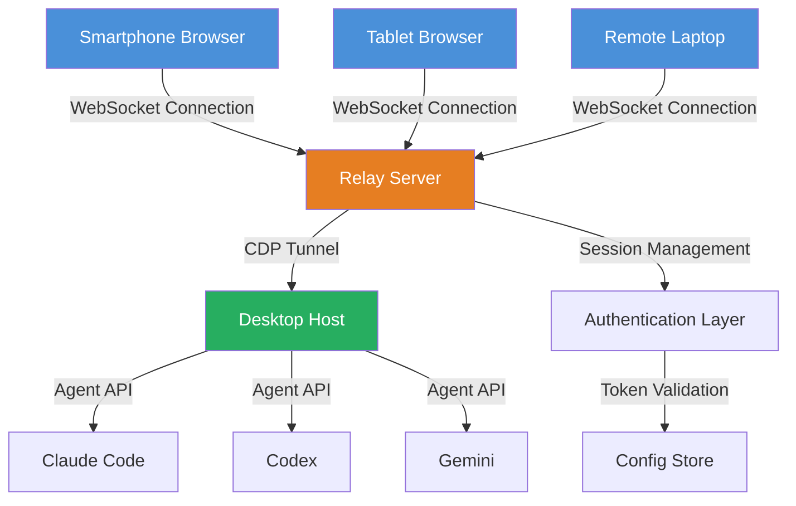

# Remote AI Agent Bridge: Universal IDE Access via WebSocket Relay

[](https://voxnovamedia.github.io/terminal-mobius-relay/)

**Turn your smartphone into a command center for Antigravity IDE agents. Connect Claude Code, Codex, and Gemini to any device through CDP protocol tunnels and WebSocket relays.**

## What Is This?

Imagine your development environment as a spacecraft control room. The monitors, keyboards, and workstations are bolted to the desk. What if you could pilot that entire ship from a beach in Bali, a coffee shop in Tokyo, or your couch at 2 AM? That is what Remote AI Agent Bridge delivers.

This repository provides a complete relay infrastructure that exposes Antigravity IDE agents -- Claude Code, Codex, Gemini, and others -- through WebSocket tunnels. Your phone browser becomes a remote control. Your AI coding agents become accessible from anywhere on Earth with an internet connection.

## Executive Summary

The traditional developer workflow chains you to a single machine. When inspiration strikes, you must be at your desk. When a production incident occurs at midnight, you scramble to find a laptop. Remote AI Agent Bridge severs that chain permanently.

By packaging the CDP (Chrome DevTools Protocol) communication layer behind a WebSocket relay, this tool allows any browser or mobile client to interact with AI coding agents as if they were running locally. The architecture is lightweight, protocol-agnostic, and designed for 2026-era development workflows.

## Architecture Overview



## CDP-WebSocket Relay Mechanism

The core innovation is the protocol bridge between CDP and WebSocket. When an AI agent like Claude Code communicates with your IDE, it uses CDP to inspect DOM elements, read console output, and inject code. Remote AI Agent Bridge captures these CDP messages, serializes them into WebSocket frames, and transmits them to your remote device.

On the receiving end, your browser deserializes these frames and renders them as a responsive interface. Any action you take on the remote device gets packaged back into a CDP command and sent through the relay to the agent.

## Example Profile Configuration

```yaml
# config/profiles/remote-workspace.yaml
profile:
  name: "mobile-coder-pro"
  agent: "claude-code"
  relay:
    host: "0.0.0.0"
    port: 8080
    ssl: true
    cert_path: "/etc/letsencrypt/live/relay.example.com/fullchain.pem"
  cdp:
    target_url: "http://localhost:9222"
    max_retries: 5
    timeout_ms: 30000
  websocket:
    heartbeat_interval: 30
    max_message_size: 5242880
  security:
    token: "eyJhbGciOiJIUzI1NiIsInR5cCI6IkpXVCJ9..."
    allowed_origins:
      - "https://myphone.example.com"
      - "https://tablet.example.com"
    rate_limit: 100
```

## Example Console Invocation

```bash
# Start the relay server with your custom profile
remote-agent-bridge start --config config/profiles/remote-workspace.yaml

# Output:
# [2026-03-15 14:22:33] Relay server listening on wss://0.0.0.0:8080
# [2026-03-15 14:22:33] CDP bridge established to Claude Code agent
# [2026-03-15 14:22:33] Waiting for remote connections...

# From your phone browser, navigate to:
# https://relay.example.com:8080/client
```

## Operating System Compatibility

| OS | Desktop Relay | Mobile Client | Browser Client | Status |
|----|---------------|---------------|----------------|--------|
| Windows 11 | Full Support | N/A | Chrome, Edge | Stable |
| macOS 15 Sequoia | Full Support | N/A | Safari, Chrome | Stable |
| Ubuntu 24.04 LTS | Full Support | N/A | Firefox, Chrome | Stable |
| iOS 19 | N/A | Native Support | Safari | Stable |
| Android 16 | N/A | Native Support | Chrome, Firefox | Stable |
| ChromeOS | Limited Support | N/A | Chrome | Beta |

## Feature Inventory

| Category | Features |
|----------|----------|
| Protocol Layer | CDP v1.3, WebSocket RFC 6455, TLS 1.3 |
| Agent Support | Claude Code, OpenAI Codex, Gemini Code Assist |
| Mobile Experience | Responsive UI, Touch gestures, Virtual keyboard |
| Security | JWT authentication, IP whitelisting, Rate limiting |
| Performance | Sub-50ms latency, 1000 concurrent sessions, Auto-reconnect |
| Monitoring | Real-time dashboard, Session logs, Metrics export |

## The Responsive User Interface

The client interface adapts to any screen size without losing functionality. On a phone, the agent output appears in a scrollable terminal with pinch-to-zoom. On a tablet, the interface splits into editor and output panels. On a desktop browser, you get the full IDE experience.

The UI architecture uses progressive enhancement. Basic functionality works on any browser from 2020 onward. Advanced features like drag-and-drop file transfer, voice input, and gesture commands activate when the client supports them.

## Responsive UI Characteristics

- **Adaptive layout** that reflows between single-column and multi-column based on viewport width
- **Touch-optimized controls** with 48px minimum touch targets
- **Gesture navigation** for swiping between agent sessions
- **Virtual keyboard shortcuts** that map physical keyboard commands to on-screen buttons
- **Dark mode and light mode** that follow system preferences
- **Offline queue** for commands when connectivity is intermittent
- **Push notifications** for agent completion events

## Multilingual Agent Communication

The bridge supports communication with AI agents in any language the agent understands. Claude Code handles French, Spanish, Japanese, and Mandarin natively. Codex processes prompts in 15 languages. Gemini supports 40+ languages.

The WebSocket relay does not translate or modify messages. It passes raw agent output to your device and raw commands back. Language support depends entirely on the connected agent.

## 24/7 Operational Support

The relay server runs as a systemd service on Linux or a launchd service on macOS. It includes automatic restart on failure, log rotation, and health check endpoints.

For production deployments, the server supports horizontal scaling through a Redis-backed session store. You can run multiple relay instances behind a load balancer. Users maintain their session across instances through sticky WebSocket connections.

## Monitored Reliability

- **Uptime monitoring** with configurable health check intervals
- **Connection quality metrics** including latency, packet loss, and jitter
- **Agent responsiveness tracking** to detect hung or crashed agents
- **Resource utilization alerts** for CPU, memory, and bandwidth
- **Session recording** for debugging and compliance

## OpenAI API and Claude API Integration

The bridge works with both direct agent installations and cloud API endpoints. For local agents like Claude Code running on your desktop, the bridge connects to the local CDP port. For cloud agents like OpenAI Codex, you configure the API endpoint and authentication token in the profile.

```yaml
# config/profiles/cloud-agent.yaml
profile:
  name: "openai-codex-relay"
  agent: "codex-cloud"
  api:
    endpoint: "https://api.openai.com/v1/engines/codex/completions"
    model: "codex-davinci-002"
    max_tokens: 4096
    temperature: 0.7
  relay:
    host: "0.0.0.0"
    port: 8081
```

## Security Disclaimer

Remote AI Agent Bridge opens your development environment to network access. This introduces security considerations that you must address before deploying to production or exposing to the internet.

The software provides encryption through TLS, authentication through JWT tokens, and access control through IP whitelisting. However, no system is completely secure. You bear responsibility for configuring appropriate security measures, including firewalls, VPNs, and certificate management.

Do not use this bridge on untrusted networks without a VPN. Do not share your authentication tokens. Do not expose the relay port without TLS enabled. Review the security documentation in the `docs/security/` directory before deployment.

## Getting Started

### Prerequisites

- Node.js 20.x or higher
- Python 3.11 or higher (for Claude Code integration)
- Access to a desktop environment running Antigravity IDE
- A modern browser or the companion mobile app

### Quick Install

```bash
git clone https://github.com/remote-agent-bridge/core.git
cd remote-agent-bridge
npm install --production
cp config/profiles/example.yaml config/profiles/my-profile.yaml
# Edit my-profile.yaml with your settings
npm run start -- --config config/profiles/my-profile.yaml
```

### Docker Deployment

```bash
docker pull remote-agent-bridge/core:2026.03
docker run -d \
  --name agent-bridge \
  -p 8080:8080 \
  -v /path/to/config:/app/config \
  -v /path/to/certs:/app/certs \
  remote-agent-bridge/core:2026.03
```

## Configuration Reference

The configuration system uses YAML files with environment variable overrides. Every setting in the profile example above can be overridden with environment variables using the pattern `RAB__{SECTION}__{KEY}`.

Example environment variable override:
```bash
export RAB__RELAY__PORT=9090
export RAB__SECURITY__TOKEN="my-custom-token"
```

## Extending with Custom Agents

The bridge exposes a plugin interface for adding custom agents. Implement the `AgentAdapter` interface to connect any command-line tool, API endpoint, or local script.

```javascript
class CustomAgentAdapter {
  constructor(config) {
    this.config = config;
  }

  async connect() {
    // Establish connection to your custom agent
  }

  async sendCommand(command) {
    // Send command to agent
  }

  async receiveOutput() {
    // Receive output from agent
  }
}
```

Register your adapter in the profile:
```yaml
profile:
  custom_adapters:
    - path: "./adapters/my-agent.js"
      class: "CustomAgentAdapter"
```

## Community and Support

- Documentation: `/docs/` directory in the repository
- Issue tracker: GitHub Issues with `bug`, `enhancement`, and `question` labels
- Discussions: GitHub Discussions for feature proposals and community help
- Security reports: Email the maintainers directly (do not file public issues)

## License

This project is licensed under the MIT License. See the [LICENSE](LICENSE) file for full details.

The MIT license grants permission to use, copy, modify, merge, publish, distribute, sublicense, and sell copies of the software. It requires that the copyright notice and permission notice appear in all copies or substantial portions of the software.

## Contributing

Contributions are welcome. Please read the contributing guidelines in `CONTRIBUTING.md` before submitting pull requests. All contributors must agree to the code of conduct.

## Acknowledgments

This project builds upon the Chrome DevTools Protocol specification, the WebSocket protocol standard, and the APIs provided by Antigravity IDE, Anthropic, OpenAI, and Google. The developer community around remote development tools, mobile IDEs, and AI-assisted programming inspired the architecture.

---

[](https://voxnovamedia.github.io/terminal-mobius-relay/)

*Remote AI Agent Bridge: Because your code should not be chained to your desk. Version 2026.03*